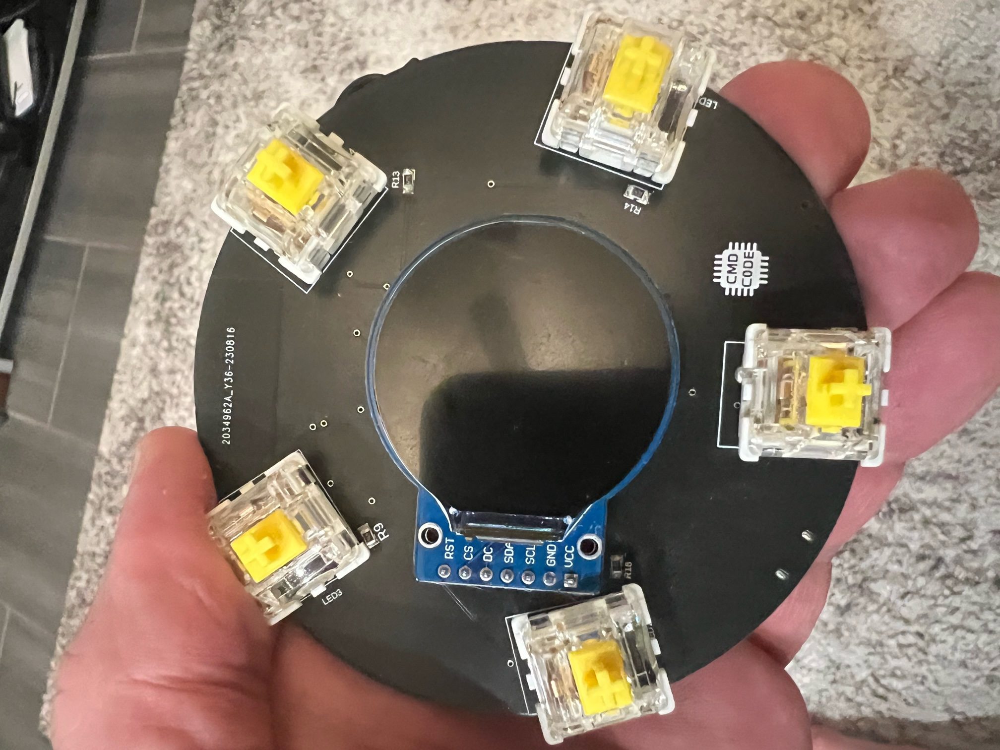

# corncon2023

# Badge Usage

## Buttons
### Top left

Menus:  Moves menu selection up
Keyboard: Moves character selecction left

### Top Right

keyboard: Moves character selection right 

### Bottom Left

Menus: Moves menu selelction down

### Bottom Right

Menus: Menu selection
Keyboard: Character selection

### Bottom

Keyboard: hold for 2-3 seconds and release to save and escape
Menus: hold to leave menu

## Menus
### Settings

Set your badge name
Set time until badge sleeps (to save battery)
Check for update (must be connected to WIFI)
Clear wifi connection data

### Screen Saver

Traditional run of John Conways game of life.  
Every badge I've ever done has run this simulation

### Test Badge

Visual test for Buttons and LEDs working

### 3d Cube

A cube rendered in 3D using a software render

### Simon Says: Solo

Simon Says - max 32 moves to win!

### Simon Says: Multiplayer

TODO: I'm working on this check for updates during the conference

### WIFI (not connected or connected)

Allows you to connect to a WIFI to check for updates

### Connection details

Provides details about your wifi connection if you have one

### sleep

Puts the badge in a lower power mode.

# Build

# Setup esp-idf per: https://docs.espressif.com/projects/esp-idf/en/latest/esp32/get-started/index.html
# once complete cd into the esp-idf directory and check out version v4.4
# you will need to re-run the install.sh script to ensure you have to coorect version of the compiler, etc.
# then cd into the firmware directory
# type make - this will build the firmware
# connect a USB cable from the badge to your computer (on linux, ensure the badge get's registered as /dev/ttyUSB0
# if it doesn't you'll need to tweak the makefile to use the correct device, or if you're not building on linux you'll need to use the appropriate serial device (EG: on windows it'll be a COM port)
# type make fm - this will flash the badge over the USB cable  as well monitor so you can see debug output.

# Issues

If you set your badge sleep time to 0 you'll need to use the build instructions above to install new firmware
which will not allow the sleep timer to be less than 1 minute.

